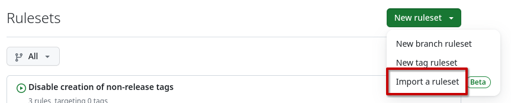

# Configure GitHub

The generated templates make some assumptions about how the GitHub repository
is configured. Here is a summary of changes you should do to the repository
{: .align-middle } to make sure everything
works as expected.

## Issues

### Labels

Review the list of labels and add:

* `part:xxx` labels that make sense to the project

* Make sure there is a `cmd:skip-release-notes` label, and if there isn't,
  create one with `930F79` as color and the following description:

    > It is not necessary to update release notes for this PR

* All labels used by automation in the project, for example look for labels listed in:

    * `.github/keylabeler.yml`
    * `.github/labeler.yml`
    * `.github/dependabot.yml`
    * `.github/workflows/release-notes-check.yml`

## Discussions

This depends on the repo, but in general we want this:

* Remove the *Show and tell* and *Poll* categories

* Rename the *Q&A* category to *Support* and change the emoji to :sos:

  This one is important to match the link provided in `.github/ISSUE_TEMPLATE/config.yml`.

## Settings

### General

#### Default branch

* Rename to `v0.x.x` (this is required for the common CI to work properly when creating releases)

#### Features

- [ ] Wikis
- [x] Issues
- [ ] Sponsorships
- [x] Projects
- [x] Preserve this repository
- [x] Discussions

#### Pull Requests

- [x] Allow merge commits: Default to pull request title and description
- [ ] Allow squash merging
- [ ] Allow rebase merging
- [ ] Always suggest updating pull request branches
- [x] Allow auto-merge
- [x] Automatically delete head branches

#### Archives

- [ ] Include Git LFS objects in archives

#### Pushes

- [x] Limit how many branches and tags can be updated in a single push: 5

### Collaborators and teams

* Give the team owning the repository *Role: Admin*
* Give *everybody* team *Role: Triage*

### Rules

#### Rulesets

Import the following
[rulesets](https://docs.github.com/en/repositories/configuring-branches-and-merges-in-your-repository/managing-rulesets/about-rulesets):

!!! Note inline end

    You might need to adapt the status checks in the *Protect version
    branches* ruleset depending on your repository configuration.



* [Disable creation of non-release
  tags]({{config.repo_url}}/blob/{{ref_name}}/github-rulesets/Disable creation of non-release tags.json)
* [Disable creation of other
  branches]({{config.repo_url}}/blob/{{ref_name}}/github-rulesets/Disable creation of other branches.json)
* [Disallow removal and force-pushes of
  gh-pages]({{config.repo_url}}/blob/{{ref_name}}/github-rulesets/Disallow removal and force-pushes of gh-pages.json)
* [Protect released
  tags]({{config.repo_url}}/blob/{{ref_name}}/github-rulesets/Protect released tags.json)
* [Queue PRs for the default
  branch]({{config.repo_url}}/blob/{{ref_name}}/github-rulesets/Queue PRs for the default branch.json)

##### Python specific rulesets

* [Protect version
  branches]({{config.repo_url}}/blob/{{ref_name}}/github-rulesets/python/Protect version branches.json)

##### API specific rulesets

API repositories should import this variant instead of the generic Python
*Protect version branches* ruleset, as it also requires the gRPC migration
workflow check.

* [Protect version
  branches]({{config.repo_url}}/blob/{{ref_name}}/github-rulesets/python/Protect API version branches.json)

##### Rust specific rulesets

* [Protect version
  branches]({{config.repo_url}}/blob/{{ref_name}}/github-rulesets/rust/Protect version branches.json)

### Code security and analysis

* Enable *Dependabot version updates* if relevant

## Code

The basic code configuration should be generate using
[repo-config](https://frequenz-floss.github.io/frequenz-repo-config-python/).

## GitHub Pages

No special configuration is needed for GitHub Pages, but you need to initialize
the `gh-pages` branch. You can read how to do this in the [Initialize GitHub
Pages](index.md#initialize-github-pages.md) section.

## GitHub Actions

### GitHub App for Dependabot workflows

The templates include several workflows that act on [Dependabot] PRs:

* **`auto-dependabot.yaml`** — auto-approves and enables auto-merge for
  routine dependency updates.
* **`repo-config-migration.yaml`** — runs the repo-config migration script
  and auto-merges only when the migration does not create commits; otherwise
  it requires manual approval and merge (see
  [Automated migration workflow](../update-to-a-new-version.md#automated-migration-workflow)
  for details).
* **`black-migration.yaml`** — reformats code when [Dependabot] opens a major
  `black` update PR (see
  [Black formatting migration workflow](../advanced-usage.md#black-formatting-migration-workflow)
  for details).
* **`grpc-migration.yaml`** — for API projects only, syncs `grpcio` and
  `protobuf` runtime floors after matching Dependabot updates (see
  [gRPC migration workflow](../advanced-usage.md#grpc-migration-workflow)
  for details).

These workflows use a [GitHub App][GitHub App] installation token instead of
`GITHUB_TOKEN`. This is intentional: actions performed with `GITHUB_TOKEN` do
not trigger certain follow-up workflow runs, which can prevent merge queue CI
(`merge_group`) from starting.

To make them work, ensure a [GitHub App][GitHub App] is installed on the
repository with at least `Pull requests: write` and `Contents: write`
permissions (add `Workflows: write` if migrations can touch
`.github/workflows/*` files).

If a migration script needs to make authenticated API calls (e.g. updating
repository settings or branch rulesets), you should also provide the
`REPO_CONFIG_MIGRATION_TOKEN` secret with a dedicated, least-privilege token
scoped to exactly what the script needs. The `REPO_CONFIG_MIGRATION_TOKEN` is
exposed to the migration script as `GH_TOKEN` / `GITHUB_TOKEN`

> [!TIP]
> It is recommended to have this secret set only when needed, and remove it
> again as soon as the migration is done. This minimizes the risk of abuse in
> case of a security issue in the migration script.

[Dependabot]: https://docs.github.com/en/code-security/dependabot/dependabot-version-updates
[GitHub App]: https://docs.github.com/en/apps/creating-github-apps
