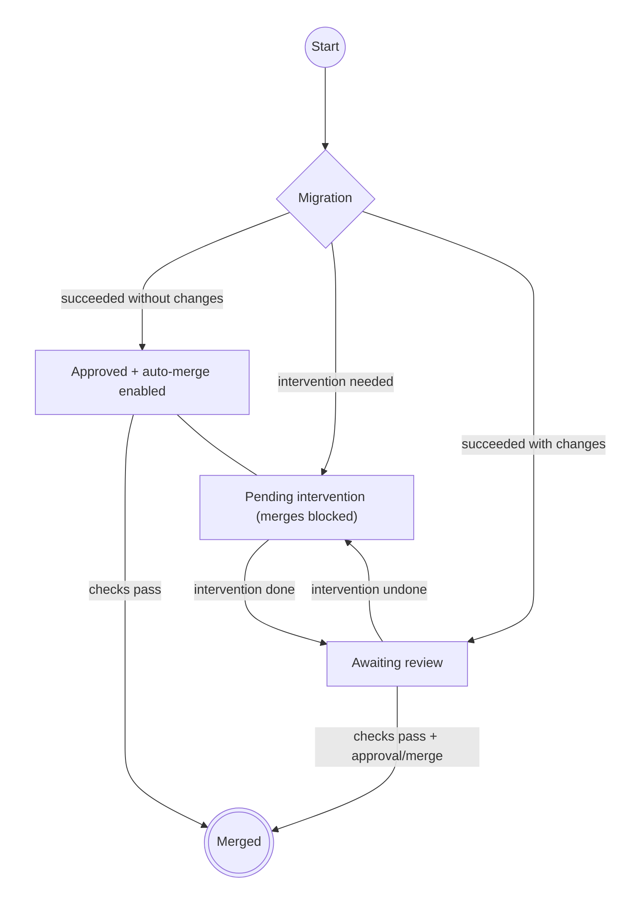


# Update to a new version

To upgrade an existing project to a new repo-config version, there are three
approaches: let the automated migration workflow handle it (default and
recommended), run the migration script manually, or re-run the [Cookiecutter]
command.

## Automated migration workflow

Projects generated from the template include a GitHub Actions workflow
(`repo-config-migration.yaml`) that runs the migration script automatically
when [Dependabot] opens a pull request for the `repo-config` dependency group.

For updates where the migration script does not create additional commits and
does not report manual steps, the workflow auto-approves and enables
auto-merge. If the migration creates commits or reports manual steps, the PR
always requires manual review, approval, and merge.



If the migration script exits with a non-zero status, the workflow:

* Posts a PR comment with the full migration output.
* Adds the `tool:repo-config:migration:intervention-pending` label.
* Fails the job, which blocks merging.

After you complete the required manual steps, push your changes to the PR
branch and signal resolution in **either** of these two ways:

* **Remove** the `tool:repo-config:migration:intervention-pending` label from
  the PR.
* **Add** the `tool:repo-config:migration:intervention-done` label to the PR.

Either action triggers the workflow again, which normalises the labels.
Whenever a migration produces commits or requires manual steps, you should
review, approve, and merge the PR yourself.

If intervention is marked as done and you later need more manual work, either
removing `tool:repo-config:migration:intervention-done` or adding
`tool:repo-config:migration:intervention-pending` marks intervention as
pending again.

!!! Note

    If you need to set up this workflow in a project that wasn't generated
    from the template, see the
    [migration workflow setup](advanced-usage.md#migration-workflow)
    section in the advanced usage page.  You will also need to configure the
    [GitHub App for Dependabot
    workflows](start-a-new-project/configure-github.md#github-app-for-dependabot-workflows).

## Use a migration script manually

If you prefer to run the migration yourself (or if your project doesn't use
the automated workflow), you can fetch the migration script from GitHub and
run it directly.

The script can't always perform all the changes necessary to migrate to a new
version. In this case, you will have to manually apply the changes. The script
will guide you through the process, so please read the script output carefully.

The script can also only migrate from one version to the next. If you are
skipping versions, you will have to run the script multiple times.

```sh
curl -sSL https://raw.githubusercontent.com/frequenz-floss/frequenz-repo-config-python/{{ ref_name }}/cookiecutter/migrate.py \
	| python3
```

Make sure that the version (`{{ ref_name }}`) matches the
target version you are migrating to.

!!! Tip "Tip for MacOS users"

    The migration script may not work out of the box on macOS. You need to
    install `coreutils` to ensure compatibility:

    ```sh
    brew install coreutils gnu-sed
    ```

    After installation, update your `PATH` in your shell configuration
    (e.g. ~/.zshrc) so that the system uses the GNU versions. Depending on
    where the packages are installed this might look like this:

    ```sh
    export PATH="/opt/homebrew/opt/coreutils/libexec/gnubin:/opt/homebrew/opt/gnu-sed/libexec/gnubin:$PATH"
    export MANPATH="/opt/homebrew/opt/coreutils/libexec/gnuman:$MANPATH"
    ```

    Then, source your configuration file again to apply the changes:

    ```sh
    source ~/.zshrc  # or ~/.bashrc, depending on your shell
    ```

## Re-run the Cookiecutter command

If you are upgrading a very old project (jumping multiple versions at the time)
it is probably easier to just regenerate the whole project.

To do so, you can use the [Cookiecutter *replay
file*](https://cookiecutter.readthedocs.io/en/stable/advanced/replay.html) that
was saved during the project generation. The file is saved as
`.cookiecutter-replay.json`. Using this file, you can re-run [Cookiecutter]
without having to enter all the inputs again.

!!! Warning

    * Don't forget to commit all changes in your repository before doing this!
      Files will be overwritten!
    * Don't forget to check all the [release
      notes](https://github.com/frequenz-floss/frequenz-repo-config-python/releases)
      for all the versions you are going to update, in particular the
      **Upgrading** section, as there might be steps necessary before even
      running the `cookiecutter` command for the update.

```sh
git commit -a  # commit all changes
cd ..
cookiecutter gh:frequenz-floss/frequenz-repo-config-python \
    --directory=cookiecutter \{{ """
    --checkout """ + version.ref_name + " \\" if version}}
    --overwrite-if-exists \
    --replay \
    --replay-file project-directory/.cookiecutter-replay.json
```

This will create a new commit with all the changes to the overwritten files.
Bear in mind that all the `TODO`s will come back, so there will be quite a bit
of cleanup to do. You can easily check what was changed using `git show`, and
you can use `git commit --amend` to amend the previous commit with the template
updates, or create a new commit with the fixes. You can also use `git citool`
or `git gui` to easily add, remove, or even discard (revert) changes in the
templates update commit.

!!! Note

    The `project-directory` is the directory of your previously generated
    project. If you renamed it, then the files will be generated in a new
    directory with the original name. You can update the target directory in
    the replay file.

!!! Note

    Please remember to keep your replay file up to date if you change any
    metadata in the project.

!!! Tip

    Please have a look at the follow-up steps listed in the [Start a new
    project](start-a-new-project/#create-the-local-environment) section to
    finish the setup.

[Cookiecutter]: https://cookiecutter.readthedocs.io/en/stable
[Dependabot]: https://docs.github.com/en/code-security/dependabot/dependabot-version-updates
